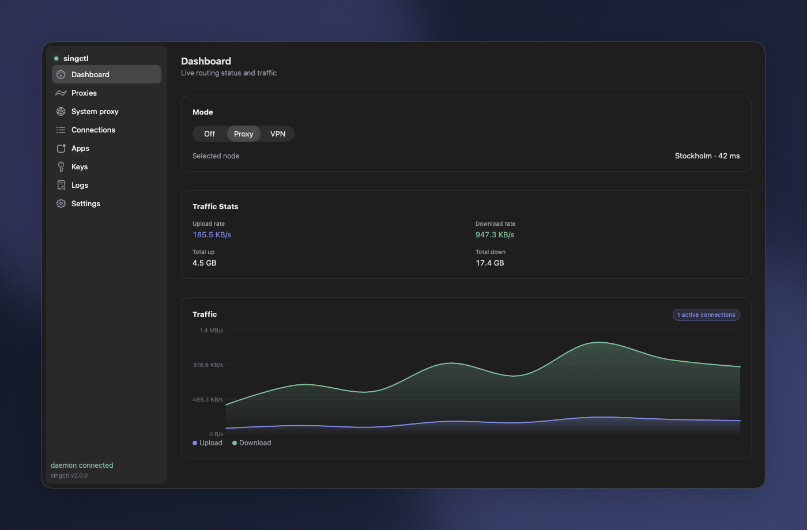

# singctl

`singctl` — VLESS-прокси/VPN-клиент на встроенном ядре **sing-box** (v1.13.12).
Поднимает локальный SOCKS/HTTP-прокси и умеет включать системный VPN-режим (TUN),
пассивно сосуществуя с Cisco Secure Client (AnyConnect). Главный сценарий —
проксировать трафик выбранных приложений через корпоративный VPN, чтобы получить
им исходящий доступ.

Проект разворачивается из CLI/TUI в готовый к продаже продукт: к утилите
добавляются фоновый сервис-демон (старт при загрузке), нативное macOS-приложение
и системные установщики.



Интерфейс на демонстрационных данных. [Как обновить скриншот](macos/Singctl/PreviewHarness/README.md).

## Ключи

Ключ — это share-ссылка. **Протокол берётся из схемы ссылки**, поэтому выбирать
его нигде не нужно: вставленный ключ сам себя описывает. Поддерживаются:

| Схема | Протокол |
| --- | --- |
| `vless://` | VLESS (в т.ч. REALITY, XTLS Vision) |
| `vmess://` | VMess (base64-JSON) |
| `trojan://` | Trojan |
| `ss://` | Shadowsocks (SIP002 и легаси-формат, включая 2022-blake3) |
| `hysteria2://`, `hy2://` | Hysteria2 |
| `hysteria://`, `hy://` | Hysteria v1 |
| `tuic://` | TUIC v5 |
| `anytls://` | AnyTLS |

`http://` и `socks://` намеренно не принимаются: вставленный `https://`-адрес
почти всегда оказывается ссылкой на подписку, а не ключом, и молча превращать
его в аутбаунд хуже, чем отклонить.

Транспорты для VLESS/VMess/Trojan: `tcp`, `grpc`, `ws`, `http` и `xhttp` (он же
устаревший `splithttp`) — последний нужен для обхода свежих блокировок РКН. Для
`type=xhttp` разбираются `path`, `host`, `mode` (`auto` / `packet-up` /
`stream-up` / `stream-one`) и `extra` (полный JSON-блок `xhttpSettings` из
панели), поверх TLS, REALITY или без шифрования:

```
vless://00000000-0000-0000-0000-000000000000@example.com:443?type=xhttp&security=reality&pbk=<pbk>&sid=<sid>&sni=www.microsoft.com&fp=chrome&path=%2Fxh&mode=auto#server
```

Ключей может быть несколько — тогда sing-box строит urltest-группу и сам берёт
самый быстрый доступный сервер (порядок ввода задаёт приоритет). Протоколы в
одной группе смешивать можно.

## Подписки

Вместо того чтобы добавлять ключи по одному, можно указать **подписку** — URL,
который выдаёт панель (v2rayTun, Happ, Marzban, Remnawave, 3x-ui и подобные):

```sh
singctl --headless --sub https://panel.example.com/sub/<token>/
```

Оттуда приезжает список share-ссылок, и singctl периодически его перечитывает,
подхватывая изменения серверов на стороне панели. В macOS-приложении это раздел
Keys: добавить, обновить все, удалить, посмотреть трафик и срок действия.

Что стоит знать про поведение:

- **Формат ответа разбирается терпимо.** Тело обычно base64 (все четыре
  варианта алфавита и паддинга), но бывает и открытым текстом. Разделителем
  бывает перевод строки, точка с запятой или запятая — при этом запятая может
  стоять и *внутри* ссылки (`alpn=h2,http/1.1`), поэтому разбиение делается по
  началу следующей ссылки, а не по разделителю.
- **Сначала напрямую, потом через свой прокси.** Хосты подписок нередко
  заблокированы — ровно та проблема, которую решает сам singctl. Если прямой
  запрос не прошёл, попытка повторяется через локальный прокси демона. Именно в
  таком порядке: обратный сделал бы обновление подписки зависимым от туннеля,
  который сам может лежать.
- **Серверы подписки принадлежат подписке.** Их нельзя переименовать или
  удалить по одному — следующее обновление всё равно отменило бы правку, поэтому
  демон отвечает внятной ошибкой вместо молчаливого отката. Удаляется подписка
  целиком. Ручные ключи живут рядом и имеют приоритет в failover-группе.
- **Неудачное обновление не роняет работающий прокси.** Если панель недоступна
  или начала отдавать мусор (например, HTML-страницу логина), сохраняется
  прошлый список серверов, а ошибка записывается и показывается в UI.
- **Период обновления** берётся из заголовка `profile-update-interval`, если
  панель его прислала, иначе 12 часов. Кэш лежит в
  `~/.config/singctl/subscriptions.json`, поэтому демон стартует с прошлыми
  серверами даже без сети.

### Известное ограничение: REALITY и часть серверов

Отдельные REALITY-серверы отвергают подключение с ошибкой
`reality verification failed`, хотя тот же ключ работает в Xray-клиентах
(v2rayTun, Happ). Это ограничение встроенного ядра, а не singctl: штатный
`vless`-аутбаунд sing-box с теми же параметрами падает точно так же, без
участия нашего кода.

Причина, судя по исходникам: REALITY-клиент sing-box жёстко проставляет в
аутентификатор версию клиента `1.8.1` и вырезает `X25519MLKEM768` из
предлагаемых кривых и key share, тогда как Xray 26.x сообщает свою настоящую
версию и постквантовый обмен сохраняет. Сервер, рассчитывающий на второе,
нас не признаёт. В `sing-box 1.14.0-rc.5` этот код не изменился, поэтому
обновление ядра проблему не решает.

Смена `fp=` (chrome / firefox / safari / ios / randomized) не помогает —
проверено. Большинство REALITY-серверов при этом работают нормально.

Апстримный sing-box XHTTP не поддерживает — транспорт реализован в самом
singctl (`internal/xhttp` + `internal/singboxext`). Ограничения и покрытие
тестами — в [PLAN.md](PLAN.md) §7.

## Компоненты

| Компонент | Где | Что делает |
| --- | --- | --- |
| **CLI / TUI** | `cmd/singctl` | терминальный интерфейс (Bubble Tea, рус.), флаги, man-страница |
| **Демон** | `singctl --daemon --headless` | фоновый рутовый сервис (LaunchDaemon/systemd), держит прокси и отдаёт control-сокет |
| **macOS-приложение** | `macos/Singctl/` | нативное SwiftUI-приложение, хостит System Extension для per-app изоляции и управляет демоном — см. [docs/macos.md](docs/macos.md) |

macOS-приложение не линкует sing-box и не требует root само по себе — все
привилегированные операции (TUN, маршруты) живут в демоне, а приложение
управляет им через control-сокет + Clash API; System Extension (для per-app
изоляции) запускается от имени пользователя после одобрения в System Settings.

## Архитектура

Гексагональная: чистое ядро решений/конфигурации, окружённое инъектируемыми
портами ввода-вывода; зависимость от sing-box изолирована за build-тегом
`singbox` в двух местах — `internal/core` (само ядро) и `internal/singboxext`
(см. ниже).

- **`internal/singbox`** — генерация JSON-конфига sing-box (чистая, без импорта
  sing-box; контракт проверяется golden-файлами).
- **`internal/core`** — абстракция над ядром: реальное (`real.go`,
  `//go:build singbox`) и заглушка/фейк для дефолтной сборки и тестов.
- **`internal/xhttp`** — клиентский транспорт Xray XHTTP (ранее SplitHTTP) для
  ключей `type=xhttp`; чистый пакет без импорта sing-box.
- **`internal/singboxext`** (`//go:build singbox`) — регистрирует в реестре
  аутбаундов sing-box собственный тип `vless-xhttp` (апстрим sing-box XHTTP не
  поддерживает); `internal/core/real.go` подключает его через
  `singboxext.OutboundRegistry()`. Второе и единственное другое место, где
  импортируется sing-box.
- **`internal/runtime`** — `Manager`: жизненный цикл двух инстансов sing-box
  (постоянный PROXY + on-demand TUN-форвардер), машина состояний.
- **`internal/policy` / `netstate` / `monitor`** — пассивное наблюдение за сетью и
  Cisco + чистый движок сосуществования (observe-only, никогда не трогаем маршруты
  AnyConnect).
- **`internal/control`** — анонс инстанса (`instance.json`) + Unix control-сокет
  (`MODE/SETTINGS/KEYS/PROC-*/TRAFFIC/CONSOLE-POLL`).
- **`internal/clashapi`** — read-only клиент Clash API sing-box (живые соединения,
  латентность, трафик).
- **`internal/app`** — `Executor`: композиционный корень, реализует `ui.Backend`.
- **`internal/ui` / `remote`** — TUI (чистый редьюсер) и backend для управления
  уже запущенным демоном.

Подробности — в [`PLAN.md`](PLAN.md); статус по пакетам — в [`STATUS.md`](STATUS.md).

### Два инстанса sing-box

- **PROXY** (постоянный): SOCKS `127.0.0.1:1080` + HTTP `127.0.0.1:2080`.
- **TUN-форвардер** (только в VPN-режиме): владеет маршрутом по умолчанию через
  `auto_route`, релеит всё в PROXY, перехватывает DNS. Подсеть `198.18.0.0/30`.

## Структура репозитория

```
cmd/singctl     CLI/TUI + точка сборки шиппинг-бинарника
cmd/server      сервер лицензий
internal/       ядро (см. «Архитектура»); sing-box импортируют только
                core/real.go и singboxext/ (обе — за -tags singbox)
macos/Singctl/  нативное macOS-приложение (SwiftUI) + System Extension
packaging/      macOS (LaunchDaemon, установщики .pkg/.dmg)
scripts/        install-macos.sh
deploy/         сервер лицензий: Dockerfile, Helm-чарт, Ansible
docs/           дополнительная документация
```

## Сборка и тесты

Дефолтная сборка/тесты **не импортируют sing-box** (линкуется заглушка) — набор
быстрый и без CGO. Реальное ядро подключается только под `-tags singbox`.

```sh
go build ./...                      # дефолтная сборка (stub-ядро)
go test ./...                       # герметичный unit + golden набор (FakeCore)
go build -tags singbox ./...        # шиппинг-сборка с реальным ядром sing-box
go test ./internal/singbox -update  # перегенерировать golden-конфиги (ревьюить дифф!)
make test-singbox-decode            # реальное ядро принимает и стартует генерируемые конфиги
make test-xhttp-e2e XRAY_BIN=<путь> # XHTTP против эталонного сервера Xray-core
```

`test-xhttp-e2e` поднимает настоящий `xray` локально и гоняет через него весь
стек (packet-up / stream-up / stream-one поверх HTTP/1.1 и HTTP/2, REALITY,
urltest-группа). Без `XRAY_BIN` тест пропускается — бинарник берётся из релизов
[XTLS/Xray-core](https://github.com/XTLS/Xray-core/releases).

Основные `make`-цели (полный список — `README-build.md`):

```sh
make build              # версионированный бинарник в ./bin/singctl
make build-all          # кросс-сборка macOS/Windows
make build-server       # сервер лицензий
make install            # установка CLI + демона (LaunchDaemon на macOS)
make app-macos          # сборка нативного macOS-приложения (macos/Singctl/)
make release-macos RELEASE_VERSION=1.5.0   # полный релиз: CLI + app + подписанные .pkg/.dmg
```

`singctl` для VPN/TUN запускается **под root** (управление TUN и маршрутами);
демон ставится как системный сервис и стартует при загрузке. Под sudo реальный
пользователь резолвится из `SUDO_USER` для владения файлами в `~/.config/singctl`.

Подробные платформенные оговорки (Windows/wintun, кросс-компиляция, man-страница) —
в [`README-build.md`](README-build.md).

## macOS-приложение

Нативное SwiftUI-приложение живёт в [`macos/Singctl/`](macos/Singctl/) и хостит
встроенный System Extension для per-app изоляции трафика. Сборка — `make
app-macos` (нужны Xcode + XcodeGen); подробнее — в [docs/macos.md](docs/macos.md).

## Системный прокси

`singctl` переключает **системный прокси macOS** на свой PROXY-инстанс
(`127.0.0.1:2080`) и обратно — как из вкладки **System proxy** в macOS-приложении,
так и через `make`-цели (см. ниже). Это встроенная функция singctl: отдельная
утилита `mac-proxy`, которой раньше решалась та же задача, больше не нужна —
`singctl` полностью её заменяет.

### Режимы

Ровно один из трёх, взаимоисключающие — переключение одного выключает другой:

- **`off`** — системный прокси выключен (это не влияет на локальный
  PROXY/TUN-датапат самого singctl, если он используется напрямую).
- **`exclude`** — проксировать **всё**, кроме того, что явно исключено
  ([direct]-список + встроенные правила для приватных сетей).
  Дефолтный режим «включил и забыл». Организационные исключения добавляются
  в локальный пользовательский файл. Соответствует `make proxy-on`.
- **`include`** — проксировать **только** то, что явно перечислено
  ([proxy]-список); всё остальное идёт напрямую. Для короткого осознанного
  allowlist вместо тоннелирования всей машины. Соответствует `make proxy-pac`.

### Формат правил (`.ini`)

Оба режима настраиваются одним `.ini`-файлом — вкладка **System proxy** его
импортирует (Import → вставить текст или выбрать файл) либо принимает то же
самое через управляющий сокет (`SYSPROXY-IMPORT`). Готовый, полностью
шаблон для локальной настройки — [`packaging/macos/singctl-proxy-rules.example.ini`](packaging/macos/singctl-proxy-rules.example.ini):

```ini
[settings]
mode = exclude          ; off | exclude | include
host = 127.0.0.1
port = 2080
service = Wi-Fi
pac_port = 21080

[proxy]                 ; force THROUGH the proxy
openai.com
*.githubusercontent.com

[direct]                ; never proxy
10.0.0.0/8
192.168.0.0/16
```

- `[settings]` — параметры самого переключателя: режим, локальный
  прокси-хост/порт, сетевой сервис macOS (`networksetup
  -listallnetworkservices`) и порт, на котором раздаётся сгенерированный PAC.
- `[proxy]` — список того, что форсируется **через** прокси.
- `[direct]` — список того, что **никогда** не проксируется.
- Запись — голый домен (совпадает с ним и всеми поддоменами), `*.`-wildcard
  или CIDR. Комментарии — `#` или `;`.
- **Приоритет:** если хост совпадает и с `[proxy]`, и с `[direct]`, побеждает
  `[proxy]`. Это важно в `exclude`-режиме, если нужно точечное исключение
  внутри более широкого `[direct]`-правила.

Импорт файла и есть весь workflow: правишь `.ini` руками (добавил/убрал
строку, перегруппировал) и переимпортируешь — отдельного шага
сборки/регенерации нет.

Шаблон содержит только безопасные generic-примеры и приватные сети. Локальные
организационные домены и другие пользовательские исключения добавляются в
свою копию файла; пакет устанавливает шаблон под именем
`singctl-proxy-rules.example.ini`, а персональный `singctl-proxy-rules.ini` не
хранится в Git и не перезаписывается при обновлении.

### `make`-цели (эквивалент для CLI/разработки)

```sh
make pac-server   # один раз: поставить localhost-сервер PAC (LaunchAgent, без sudo)
make proxy-on     # EXCLUDE: проксировать всё, кроме private/Russian + простых имён
make proxy-pac    # INCLUDE: проксировать ТОЛЬКО домены из packaging/macos/proxy-domains.txt
make proxy-off    # выключить (и manual, и PAC)
make proxy-status # показать текущее состояние
```

Оба режима работают через **PAC**, который отдаётся по `http://127.0.0.1:21080/`
локальным LaunchAgent'ом (`make pac-server` ставит его; `proxy-on`/`proxy-pac`
поднимают сами, если не запущен). PAC по `http://`, а не `file://`, — потому что
**Chrome не грузит PAC из `file://`**. Уважают системный прокси только
CFNetwork-приложения (Safari/Chrome/GUI); CLI (`curl`/`git`) — нет, им нужны
`HTTP(S)_PROXY`.

**EXCLUDE-режим** (`proxy-on`) держит вне прокси: простые hostname без точек
(«exclude simple hostnames»), приватные/CGNAT-диапазоны, `.ru`/`.рф`, а также список российских сервисов на
не-`.ru` доменах. Последний тянется из v2fly `category-ru`
(`packaging/macos/fetch-ru-domains.sh`) в кэш `~/.config/singctl/ru-domains.txt`
с закоммиченным fallback'ом `packaging/macos/ru-extra.txt`; `proxy-on`
применяется мгновенно из кэша и обновляет его в фоне. Правила и генерация —
`packaging/macos/gen-exclude-pac.sh`.

Параметры переопределяются переменными, напр.
`make proxy-on PROXY_SERVICE=Ethernet PROXY_PORT=1080`.

## Разработка

- **Трекинг задач — beads (`bd`)**, не TODO-списки. `bd prime` — контекст и
  команды, `bd ready` — доступная работа.
- Чистые пакеты (`vless`, `singbox`, `policy`) тестируются напрямую; всё с
  вводом-выводом — за интерфейсом с фейком.
- Golden-тесты для всего JSON sing-box (не править руками — перегенерировать).
- Строки TUI/логов — на русском; интерфейс GUI — на английском.

Инструкции для ИИ-агентов и инварианты, которые нельзя ломать, — в
[`CLAUDE.md`](CLAUDE.md) / [`AGENTS.md`](AGENTS.md).
